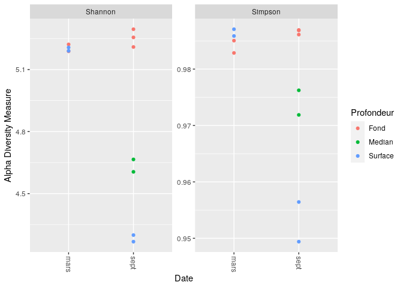

cc2\_ecog2
================

  - [Dada2](#dada2)
  - [Learn the Error Rates](#learn-the-error-rates)
  - [Construct sequence table and remove
    chimeras](#construct-sequence-table-and-remove-chimeras)
  - [Remove chimeras](#remove-chimeras)
  - [Track reads through the
    pipeline](#track-reads-through-the-pipeline)
  - [Assign taxonomy](#assign-taxonomy)
  - [Combine data into a phyloseq
    object](#combine-data-into-a-phyloseq-object)

# Dada2

``` r
library("rmarkdown")
library("knitr")
```

``` r
library(dada2)
library(ggplot2)
library(gridExtra)
library(phyloseq)
library(DECIPHER)
library(phangorn)
library(Biostrings)
```

``` r
miseq_path <- "~/CC2_Ecog2-FZM/St_Stratif_10sept14_et_11_mars" # CHANGE ME to the directory containing the fastq files after unzipping.
list.files(miseq_path)
```

    ##  [1] "filtered"                            "Station5_Fond1_10sept14_R1.fastq"   
    ##  [3] "Station5_Fond1_10sept14_R2.fastq"    "Station5_Fond1_11mars15_R1.fastq"   
    ##  [5] "Station5_Fond1_11mars15_R2.fastq"    "Station5_Fond2_10sept14_R1.fastq"   
    ##  [7] "Station5_Fond2_10sept14_R2.fastq"    "Station5_Fond2_11mars15_R1.fastq"   
    ##  [9] "Station5_Fond2_11mars15_R2.fastq"    "Station5_Fond3_10sept14_R1.fastq"   
    ## [11] "Station5_Fond3_10sept14_R2.fastq"    "Station5_Median1_10sept14_R1.fastq" 
    ## [13] "Station5_Median1_10sept14_R2.fastq"  "Station5_Median2_10sept14_R1.fastq" 
    ## [15] "Station5_Median2_10sept14_R2.fastq"  "Station5_Surface1_10sept14_R1.fastq"
    ## [17] "Station5_Surface1_10sept14_R2.fastq" "Station5_Surface1_11mars15_R1.fastq"
    ## [19] "Station5_Surface1_11mars15_R2.fastq" "Station5_Surface2_10sept14_R1.fastq"
    ## [21] "Station5_Surface2_10sept14_R2.fastq" "Station5_Surface2_11mars15_R1.fastq"
    ## [23] "Station5_Surface2_11mars15_R2.fastq"

\#pour les echantillions 10sept14 et 11mars15

``` r
fnFs <- sort(list.files(miseq_path, pattern="_R1.fastq", full.names = TRUE))
fnRs <- sort(list.files(miseq_path, pattern="_R2.fastq", full.names = TRUE))
sample.names <- sapply(strsplit(basename(fnFs), "_R"), `[`, 1)
sample.names
```

    ##  [1] "Station5_Fond1_10sept14"    "Station5_Fond1_11mars15"   
    ##  [3] "Station5_Fond2_10sept14"    "Station5_Fond2_11mars15"   
    ##  [5] "Station5_Fond3_10sept14"    "Station5_Median1_10sept14" 
    ##  [7] "Station5_Median2_10sept14"  "Station5_Surface1_10sept14"
    ##  [9] "Station5_Surface1_11mars15" "Station5_Surface2_10sept14"
    ## [11] "Station5_Surface2_11mars15"

\#Visualiser les profils de qualité des lectures avant:

``` r
plotQualityProfile(fnFs[1:2])
```

<!-- -->

\#visualiser le profil de qualité des lectures inversées

``` r
plotQualityProfile(fnRs[1:2])
```

<!-- -->

\#Filtrer et couper

``` r
# Place filtered files in filtered/ subdirectory
filtFs <- file.path(miseq_path, "filtered", paste0(sample.names, "_F_filt.fastq.gz"))
filtRs <- file.path(miseq_path, "filtered", paste0(sample.names, "_R_filt.fastq.gz"))
names(filtFs) <- sample.names
names(filtRs) <- sample.names
```

``` r
out <- filterAndTrim(fnFs, filtFs, fnRs, filtRs, truncLen=c(250,190), trimLeft = c(21,21),
              maxN=0, maxEE=c(2,2), truncQ=2, rm.phix=TRUE,
              compress=TRUE, multithread=TRUE) # On Windows set multithread=FALSE
head(out)
```

    ##                                    reads.in reads.out
    ## Station5_Fond1_10sept14_R1.fastq     159971    147108
    ## Station5_Fond1_11mars15_R1.fastq     175993    161890
    ## Station5_Fond2_10sept14_R1.fastq     197039    179186
    ## Station5_Fond2_11mars15_R1.fastq      87585     80696
    ## Station5_Fond3_10sept14_R1.fastq     117140    107357
    ## Station5_Median1_10sept14_R1.fastq   116519    107543

``` r
derepFs <- derepFastq(filtFs, verbose=TRUE)
derepRs <- derepFastq(filtRs, verbose=TRUE)
# Name the derep-class objects by the sample names
names(derepFs) <- sample.names
names(derepRs) <- sample.names
```

# Learn the Error Rates

``` r
errF <- learnErrors(filtFs, multithread=TRUE)
```

    ## 111794136 total bases in 488184 reads from 3 samples will be used for learning the error rates.

``` r
errR <- learnErrors(filtRs, multithread=TRUE)
```

    ## 114284053 total bases in 676237 reads from 5 samples will be used for learning the error rates.

\#Apprener les taux d’erreur

``` r
plotErrors(errF, nominalQ=TRUE)
```

<!-- -->

``` r
plotErrors(errR, nominalQ=TRUE)
```

<!-- -->

``` r
dadaFs <- dada(derepFs, err=errF, multithread=TRUE)
```

    ## Sample 1 - 147108 reads in 40986 unique sequences.
    ## Sample 2 - 161890 reads in 38717 unique sequences.
    ## Sample 3 - 179186 reads in 51065 unique sequences.
    ## Sample 4 - 80696 reads in 21931 unique sequences.
    ## Sample 5 - 107357 reads in 32665 unique sequences.
    ## Sample 6 - 107543 reads in 30714 unique sequences.
    ## Sample 7 - 99695 reads in 27610 unique sequences.
    ## Sample 8 - 108343 reads in 28698 unique sequences.
    ## Sample 9 - 71793 reads in 19369 unique sequences.
    ## Sample 10 - 79489 reads in 22007 unique sequences.
    ## Sample 11 - 92525 reads in 26459 unique sequences.

``` r
dadaRs <- dada(derepRs, err=errR, multithread=TRUE)
```

    ## Sample 1 - 147108 reads in 44115 unique sequences.
    ## Sample 2 - 161890 reads in 40258 unique sequences.
    ## Sample 3 - 179186 reads in 53999 unique sequences.
    ## Sample 4 - 80696 reads in 22385 unique sequences.
    ## Sample 5 - 107357 reads in 33672 unique sequences.
    ## Sample 6 - 107543 reads in 30572 unique sequences.
    ## Sample 7 - 99695 reads in 28156 unique sequences.
    ## Sample 8 - 108343 reads in 27999 unique sequences.
    ## Sample 9 - 71793 reads in 20739 unique sequences.
    ## Sample 10 - 79489 reads in 21406 unique sequences.
    ## Sample 11 - 92525 reads in 27403 unique sequences.

``` r
dadaFs[[1]]
```

    ## dada-class: object describing DADA2 denoising results
    ## 1038 sequence variants were inferred from 40986 input unique sequences.
    ## Key parameters: OMEGA_A = 1e-40, OMEGA_C = 1e-40, BAND_SIZE = 16

# Construct sequence table and remove chimeras

``` r
mergers <- mergePairs(dadaFs, derepFs, dadaRs, derepRs)
# Inspect the merger data.frame from the first sample
head(mergers[[1]])
```

    ##                                                                                                                                                                                                                                                                                                                                                                                sequence
    ## 1     TACGAAGGGACCTAGCGTAGTTCGGAATTACTGGGCTTAAAGAGTTCGTAGGTGGTTGAAAAAGTTAGTGGTGAAATCCCAGAGCTTAACTCTGGAACTGCCATTAAAACTTTTCAGCTAGAGTATGATAGAGGAAAGCAGAATTTCTAGTGTAGAGGTGAAATTCGTAGATATTAGAAAGAATACCAATTGCGAAGGCAGCTTTCTGGATCATTACTGACACTGAGGAACGAAAGCATGGGTAGCGAAGAGGATTAGATACCCTCGTAGTCCATGCCGTAAACGATGTGTGTTAGACGTTGGAAATTTATTTTCAGTGTCGCAGGGAAACCGATAAACACACCGCCTGGGGAGTACGACCGCAAGGTT
    ## 2     TACGAAGGGACCTAGCGTAGTTCGGAATTACTGGGCTTAAAGAGTTCGTAGGTGGTTGAAAAAGTTGGTGGTGAAATCCCAGAGCTTAACTCTGGAACTGCCATCAAAACTTTTCAGCTAGAGTATGATAGAGGAAAGCAGAATTTCTAGTGTAGAGGTGAAATTCGTAGATATTAGAAAGAATACCAATTGCGAAGGCAGCTTTCTGGATCATTACTGACACTGAGGAACGAAAGCATGGGTAGCGAAGAGGATTAGATACCCTCGTAGTCCATGCCGTAAACGATGTGTGTTAGACGTTGGAAATTTATTTTCAGTGTCGCAGCGAAAGCGATAAACACACCGCCTGGGGAGTACGACCGCAAGGTT
    ## 3     TACGAAGGGACCTAGCGTAGTTCGGAATTACTGGGCTTAAAGAGTTCGTAGGTGGTTGAAAAAGTTGGTGGTGAAATCCCAGAGCTTAACTCTGGAACTGCCATCAAAACTTTTCAGCTAGAGTTTGATAGAGGAAAGCAGAATTTCTAGTGTAGAGGTGAAATTCGTAGATATTAGAAAGAATACCAATTGCGAAGGCAGCTTTCTGGATCATTACTGACACTGAGGAACGAAAGCATGGGTAGCGAAGAGGATTAGATACCCTCGTAGTCCATGCCGTAAACGATGTGTGTTAGACGTTGGAAATTTATTTTCAGTGTCGCAGCGAAAGCGATAAACACACCGCCTGGGGAGTACGACCGCAAGGTT
    ## 4     TACGAAGGGACCTAGCGTAGTTCGGAATTACTGGGCTTAAAGAGTTCGTAGGTGGTTGAAAAAGTTAGTGGTGAAATCCCAGAGCTTAACTCTGGAACTGCCATTAAAACTTTTCAGCTAGAGTATGATAGAGGAAAGCAGAATTTCTAGTGTAGAGGTGAAATTCGTAGATATTAGAAAGAATACCAATTGCGAAGGCAGCTTTCTGGATCATTACTGACACTGAGGAACGAAAGCATGGGTAGCGAAGAGGATTAGATACCCTCGTAGTCCATGCCGTAAACGATGTGTGTTAGACGTTGGAAATTTATTTTCAGTGTCGCAGCGAAAGCGATAAACACACCGCCTGGGGAGTACGACCGCAAGGTT
    ## 5     TACGAAGGGACCTAGCGTAGTTCGGAATTACTGGGCTTAAAGAGTTCGTAGGTGGTTGAAAAAGTTGGTGGTGAAATCCCAGAGCTTAACTCTGGAACTGCCATCAAAACTTTTCAGCTAGAGTATGATAGAGGAAAGCAGAATTTCTAGTGTAGAGGTGAAATTCGTAGATATTAGAAAGAATACCAATTGCGAAGGCAGCTTTCTGGATCATTACTGACACTGAGGAACGAAAGCATGGGTAGCGAAGAGGATTAGATACCCTCGTAGTCCATGCCGTAAACGATGTGTGTTAGACGTTGGAAATTTATTTTCAGTGTCGCAGGGAAACCGATAAACACACCGCCTGGGGAGTACGACCGCAAGGTT
    ## 6 TACGAGGGGTCCTAGCGTTGTCCGGATTTACTGGGCGTAAAGGGTACGTAGGCGTTTTAATAAGTTGTATGTTAAATATCTTAGCTTAACTAAGAAAGTGCATACAAAACTGTTAAGATAGAGTTTGAGAGAGGAACGCAGAATTCATGGTGGAGCGGTGACATGCGTAGATATCATGAGGAAAGTCAAATGCGAAGGCAGCCTTCTGGCTCAAAACTGACGCTGAGGTACGAAAGCGTGGGGAGCGAACAGGATTAGATACCCTGGTAGTCCACGCCGTAAACGATGAGTATTTGGTGCTGGGGGATTCGACCCTTTCAGTGCCGTAGCTAACGCGATAAATACTCCGCCTGGGGACTACGATCGCAAGATT
    ##   abundance forward reverse nmatch nmismatch nindel prefer accept
    ## 1      5267       1       2     29         0      0      2   TRUE
    ## 2      4153       2       1     29         0      0      2   TRUE
    ## 3      3803       3       1     29         0      0      2   TRUE
    ## 4      2536       1       1     29         0      0      2   TRUE
    ## 5      2194       2       2     29         0      0      2   TRUE
    ## 6      2163       5       9     25         0      0      1   TRUE

``` r
seqtabAll <- makeSequenceTable(mergers[!grepl("Mock", names(mergers))])
table(nchar(getSequences(seqtabAll)))
```

    ## 
    ##  229  352  353  362  363  364  365  366  367  368  369  370  371  372  373  374 
    ##    1    2    1    1    1    4  214   24  171  196 5122 3871 2463 2624 2884  104 
    ##  375  376  377  378  382  386 
    ## 1898   96    5    1    1    3

# Remove chimeras

``` r
seqtabNoC <- removeBimeraDenovo(seqtabAll)
```

# Track reads through the pipeline

``` r
getN <- function(x) sum(getUniques(x))
track <- cbind(out, sapply(dadaFs, getN), sapply(dadaRs, getN), sapply(mergers, getN), rowSums(seqtabNoC))
# If processing a single sample, remove the sapply calls: e.g. replace sapply(dadaFs, getN) with getN(dadaFs)
colnames(track) <- c("input", "filtered", "denoisedF", "denoisedR", "merged", "nonchim")
rownames(track) <- sample.names
head(track)
```

    ##                            input filtered denoisedF denoisedR merged nonchim
    ## Station5_Fond1_10sept14   159971   147108    143916    145006 118084   88823
    ## Station5_Fond1_11mars15   175993   161890    158973    160062 138666  112142
    ## Station5_Fond2_10sept14   197039   179186    174838    177023 143461  104818
    ## Station5_Fond2_11mars15    87585    80696     78973     79577  67177   54895
    ## Station5_Fond3_10sept14   117140   107357    104482    105780  84110   64854
    ## Station5_Median1_10sept14 116519   107543    105157    106144  87738   66113

# Assign taxonomy

``` r
taxa <- assignTaxonomy(seqtabNoC, "~/CC2_Ecog2-FZM/silva_nr99_v138_train_set.fa.gz", multithread=TRUE)
```

``` r
taxa <- addSpecies(taxa, "~/CC2_Ecog2-FZM/silva_species_assignment_v138.fa.gz")
```

``` r
taxa.print <- taxa # Removing sequence rownames for display only
rownames(taxa.print) <- NULL
head(taxa.print)
```

    ##      Kingdom    Phylum             Class                 Order            
    ## [1,] "Bacteria" "Proteobacteria"   "Alphaproteobacteria" "SAR11 clade"    
    ## [2,] "Bacteria" "Cyanobacteria"    "Cyanobacteriia"      "Synechococcales"
    ## [3,] "Bacteria" "Proteobacteria"   "Alphaproteobacteria" "SAR11 clade"    
    ## [4,] "Bacteria" "Proteobacteria"   "Alphaproteobacteria" "SAR11 clade"    
    ## [5,] "Bacteria" "Proteobacteria"   "Alphaproteobacteria" "SAR11 clade"    
    ## [6,] "Bacteria" "Actinobacteriota" "Acidimicrobiia"      "Actinomarinales"
    ##      Family             Genus                     Species
    ## [1,] "Clade I"          "Clade Ia"                NA     
    ## [2,] "Cyanobiaceae"     "Synechococcus CC9902"    NA     
    ## [3,] "Clade I"          "Clade Ia"                NA     
    ## [4,] "Clade I"          "Clade Ia"                NA     
    ## [5,] "Clade II"         NA                        NA     
    ## [6,] "Actinomarinaceae" "Candidatus Actinomarina" NA

# Combine data into a phyloseq object

``` r
samdf <-read.table('~/CC2_Ecog2-FZM/samdf.csv', sep=',', header=TRUE, row.names=1)
```

``` r
ps <- phyloseq(otu_table(seqtabNoC, taxa_are_rows=FALSE), 
               sample_data(samdf), 
               tax_table(taxa))
ps
```

    ## phyloseq-class experiment-level object
    ## otu_table()   OTU Table:         [ 1583 taxa and 11 samples ]
    ## sample_data() Sample Data:       [ 11 samples by 2 sample variables ]
    ## tax_table()   Taxonomy Table:    [ 1583 taxa by 7 taxonomic ranks ]

Visualisez la diversité alpha par indice de Shannon et Simpson

``` r
plot_richness(ps, x="Date", measures=c("Shannon", "Simpson"), color="Profondeur")
```

<!-- -->

\#taxonomie filtring

``` r
rank_names(ps)
```

    ## [1] "Kingdom" "Phylum"  "Class"   "Order"   "Family"  "Genus"   "Species"

``` r
table(tax_table(ps)[, "Phylum"], exclude = NULL)
```

    ## 
    ##              Actinobacteriota                  Bacteroidota 
    ##                            21                           234 
    ##              Bdellovibrionota              Campilobacterota 
    ##                            32                             1 
    ##                   Chloroflexi                 Crenarchaeota 
    ##                            19                             7 
    ##                 Cyanobacteria                  Dadabacteria 
    ##                           167                             3 
    ##                  Dependentiae              Desulfobacterota 
    ##                             2                            11 
    ##               Elusimicrobiota                Fibrobacterota 
    ##                             1                             2 
    ##               Gemmatimonadota               Hydrogenedentes 
    ##                             8                             1 
    ##              Margulisbacteria Marinimicrobia (SAR406 clade) 
    ##                            19                            80 
    ##                   Myxococcota                         NB1-j 
    ##                             5                             2 
    ##                  Nitrospinota                       PAUC34f 
    ##                            19                             4 
    ##               Planctomycetota                Proteobacteria 
    ##                            32                           779 
    ##  SAR324 clade(Marine group B)              Thermoplasmatota 
    ##                            20                            25 
    ##             Verrucomicrobiota                          <NA> 
    ##                            78                            11

``` r
ps <- subset_taxa(ps, !is.na(Phylum) & !Phylum %in% c("", "uncharacterized"))
```

``` r
# Compute prevalence of each feature, store as data.frame
prevdf = apply(X = otu_table(ps),
               MARGIN = ifelse(taxa_are_rows(ps), yes = 1, no = 2),
               FUN = function(x){sum(x > 0)})
# Add taxonomy and total read counts to this data.frame
prevdf = data.frame(Prevalence = prevdf,
                    TotalAbundance = taxa_sums(ps),
                    tax_table(ps))
```

``` r
plyr::ddply(prevdf, "Phylum", function(df1){cbind(mean(df1$Prevalence),sum(df1$Prevalence))})
```

    ##                           Phylum        1    2
    ## 1               Actinobacteriota 3.857143   81
    ## 2                   Bacteroidota 4.034188  944
    ## 3               Bdellovibrionota 2.468750   79
    ## 4               Campilobacterota 2.000000    2
    ## 5                    Chloroflexi 4.578947   87
    ## 6                  Crenarchaeota 4.571429   32
    ## 7                  Cyanobacteria 2.964072  495
    ## 8                   Dadabacteria 4.666667   14
    ## 9                   Dependentiae 1.000000    2
    ## 10              Desulfobacterota 1.909091   21
    ## 11               Elusimicrobiota 1.000000    1
    ## 12                Fibrobacterota 2.500000    5
    ## 13               Gemmatimonadota 2.125000   17
    ## 14               Hydrogenedentes 1.000000    1
    ## 15              Margulisbacteria 2.000000   38
    ## 16 Marinimicrobia (SAR406 clade) 4.425000  354
    ## 17                   Myxococcota 2.400000   12
    ## 18                         NB1-j 1.500000    3
    ## 19                  Nitrospinota 4.263158   81
    ## 20                       PAUC34f 3.250000   13
    ## 21               Planctomycetota 3.437500  110
    ## 22                Proteobacteria 4.216945 3285
    ## 23  SAR324 clade(Marine group B) 4.450000   89
    ## 24              Thermoplasmatota 2.280000   57
    ## 25             Verrucomicrobiota 3.653846  285

\#Prevalence Filtering

``` r
# Subset to the remaining phyla
prevdf1 = subset(prevdf, Phylum %in% get_taxa_unique(ps, "Phylum"))
ggplot(prevdf1, aes(TotalAbundance, Prevalence / nsamples(ps),color=Phylum)) +
  # Include a guess for parameter
  geom_hline(yintercept = 0.05, alpha = 0.5, linetype = 2) +  geom_point(size = 2, alpha = 0.7) +
  scale_x_log10() +  xlab("Total Abundance") + ylab("Prevalence [Frac. Samples]") +
  facet_wrap(~Phylum) + theme(legend.position="none")
```

<!-- -->

``` r
ggsave("pcoa.jpg", width = 250, height = 100, units = "mm")
```

``` r
pslog <- transform_sample_counts(ps, function(x) log(1 + x))
out.wuf.log <- ordinate(pslog, method = "PCoA", distance = "bray")
```

\#Visualiser les influences relative de la profondeur et de la saison
sur la structure des communautes planctoniques de la rade de Bres

``` r
evals <- out.wuf.log$values$Eigenvalues
plot_ordination(pslog, out.wuf.log, color = "Profondeur", shape="Date") +
  labs(col = "Profondeur",shape= "Date")
```

<!-- -->

``` r
ggsave("pcoa.jpg", width = 150, height = 100, units = "mm")
```

\#Visualiser les biomarqueurs de profondeur

``` r
top20 <- names(sort(taxa_sums(ps), decreasing=TRUE))[1:20]
ps.top20 <- transform_sample_counts(ps, function(OTU) OTU/sum(OTU))
ps.top20 <- prune_taxa(top20, ps.top20)
plot_bar(ps.top20, x="Date", fill="Genus") + facet_wrap(~Profondeur, scales="free_x")
```

<!-- -->

\#Visualiser les biomarqueurs de saison (hivers et ete)

``` r
top20 <- names(sort(taxa_sums(ps), decreasing=TRUE))[1:20]
ps.top20 <- transform_sample_counts(ps, function(OTU) OTU/sum(OTU))
ps.top20 <- prune_taxa(top20, ps.top20)
plot_bar(ps.top20, x="Profondeur", fill="Genus") + facet_wrap(~Date, scales="free_x")
```

<!-- -->

``` r
ggsave("abondance1.jpg", width = 150, height = 100, units = "mm")
```

``` r
library(ggplot2)
ggsave("abundance_parperiode.jpg",width = 150,height = 100,units = "mm")
```
